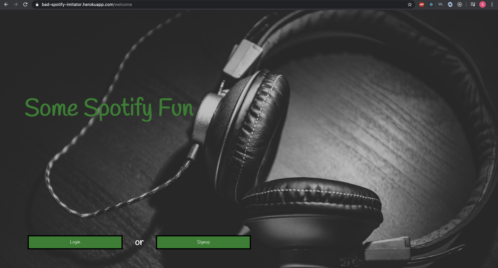
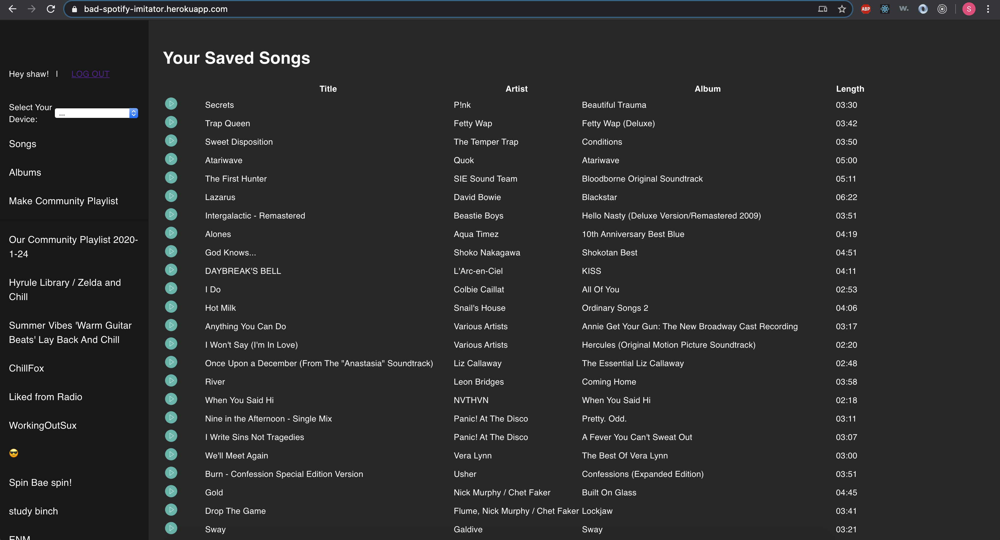
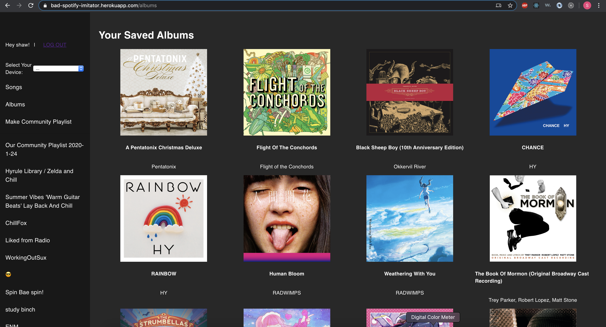
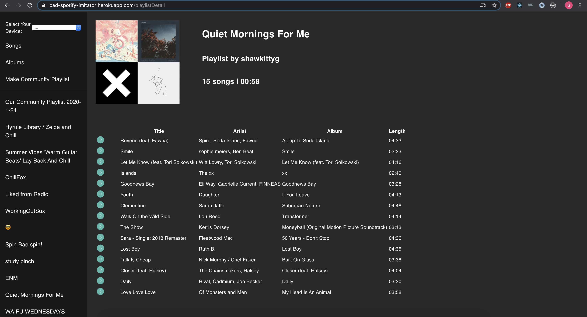

# Bad Spotify Imitator
The Bad Spotify imitator is a web application that allows Spotify Premium subscribers to look at different aspects of their Spotify library, and also play songs from any of their available devices. 

## Technologies Used
- MongoDB hosted on mongoDB with Mongoose for queries and updates
- Express
- React
- NodeJS
- JWT for user authentication
- Heroku for web deployment
- The Spotify API

## Getting Started
Please go to the deployed application at https://bad-spotify-imitator.herokuapp.com/

This service is only available to Spotify Premium subscribers. If you are one, you will need to create an account with this application, and grant us authorization to access your account. One of the funner features of this application is creating the community playlist - a playlist that randomly selects thirty songs from all of the application's users' top played tracks. 

If you would like to play songs, you will need to select an available device to play the song from. You can do this via the menu input on the left hand side. Once a device has been selected, the play button next to each song will start the song.

## Next Steps
- Allow users to search for songs/albums/artists/playlists
- Allow users to edit their playlists and library
- Allow users to queue songs for playback
- Allow users to view fun statistics about their libraries